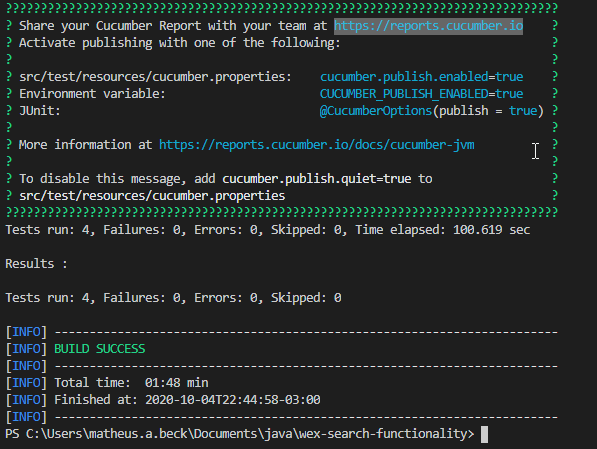

# 👨‍💻 QA Java, Cucumber and Selenium Challenge

<p align="center">
  
</p>

<p align="center">
  
  
  
  
</p>

Java, Cucumber and Selenium front-end test in the search functionality of a website (`https://www.wexinc.com/`) for the tech QA challenge from a company. The features of the tests are inside `src/test/resources/wexsearchfunctionality/search_functionality.feature` and the step definitions are inside `src/test/java/wexsearchfunctionality/StepDefinitions.java`

## 🎥 Tests Execution Demonstration


## 📅 Test plan
- [Link to Test Plan](Beck_Matheus_QATask.pdf)

## 💾 Development Dependencies Used

- "Apahce Maven": "3.6.3"
- "Java":  "1.8.0"
- "Cucumber": "6.7.0"
- "Selenium Web Driver": "3.141.59"
- "Chrome Driver": "85.0.4183.87"
- "Google Chrome": "85.0.4183.121"

## 🎬 Getting Started

1. Clone the project into your machine, install all dependencies described above and compile the project using:

```console
mvn install
```

2. Now, to run the tests:

```console
mvn test
```

3. Verify the tests results output:



<h2><a class="anchor" aria-hidden="true" href="#memo-license">:pencil:</a> License </h2>
<p>This project is under the MIT license. See the <a href="https://github.com/matheus-beck/blog/blob/master/LICENSE">LICENSE</a> for more information.</p>
---

Made with ❤️ by Matheus Beck 👋 [Get in touch!](https://www.linkedin.com/in/matheus-beck/)

